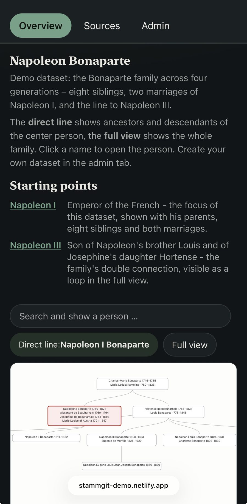
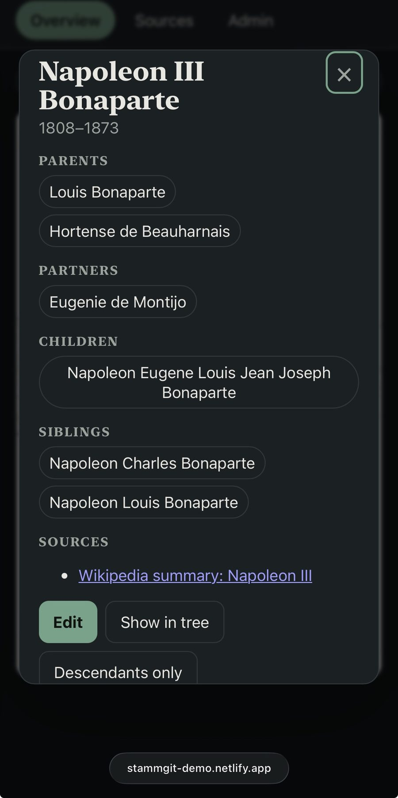

# stammgit

Git-native family trees. The data is plain YAML in your own repository,
every change is a Git commit, the app is a static site plus a few
serverless functions, built to deploy on Netlify — with a standalone
server for local hosting included. No database, no lock-in. (*Stammbaum*
is German for family tree.)

## Demo

**[stammgit-demo.netlify.app](https://stammgit-demo.netlify.app)** –
sign in with password `admin` (full access) or `user` (read-only).
Editing is local-first, so every visitor plays in their own browser
sandbox and the repository stays untouched. Want to see it at scale?
Import [royal92.ged](https://github.com/D-Jeffrey/gedcom-samples/blob/main/royal/royal92.ged)
(3,010 persons of European royalty, public domain) as a new dataset in
the admin tab – it renders instantly.

<p align="center">

&emsp;&emsp;

</p>

## Run it locally

```bash
git clone https://github.com/kstucki/stammgit.git
cd stammgit
npm install
cp .env.example .env    # set FAMILY_TREE_PASSWORD
npm start               # build + serve on http://localhost:8888
```

Without GitHub credentials the server runs in **local write mode**: Sync
writes straight into the working directory and validates with the full
test suite. Invalid data is rejected and rolled back. Set `LOCAL_GIT=1`
to get a local Git commit per sync.

## Make it yours

Napoleon is just the demo dataset. Everything instance-specific lives in
`data/config.yaml` — edit it in your editor or directly on GitHub, it is
never written by the app:

```yaml
language: en                # UI language: de | en
title: "Family Tree"        # browser tab
eyebrow: "Private family archive"
defaultTree: napoleon       # what visitors see: data/trees/<name>.yaml

overview:
  heading: "Napoleon Bonaparte"
  intro: "One or two sentences shown above the tree."
  note: "Supports <b>HTML</b>; explain the views or your data here."
  linesHeading: "Starting points"
  extraLines:               # optional jump links into the tree
    - label: "Napoleon I"
      person: napoleon_i_bonaparte
      text: "Description shown next to the link."
```

Typical path: create your dataset in the app (admin → New dataset, or
GEDCOM import), sync it, then point `defaultTree` at it and rewrite the
overview texts. The build validates the config, including every
`extraLines` person id. Afterwards the demo data can go: delete
`data/trees/napoleon.yaml` and its source sheets
(`public/sources/wikipedia-*.pdf`) without hesitation – the build prints a
note for source files no longer referenced by any dataset, so leftovers
are easy to spot.

## What it does

- Three views: direct line (hourglass), full family, descendants of one
  person. Custom layout engine with sibling blocks and crossing
  minimization.
- Browser editing: persons, relationships, notes, merge duplicates,
  delete with cleanup. Changes are drafts on your device until **Sync**
  publishes them as Git commits.
- Sources per person: file uploads (kept in the browser until sync) and
  external links (archives, Wikipedia).
- GEDCOM import/export, multiple datasets, downloads as YAML/JSON/GEDCOM/ZIP.
- Two roles (admin, read-only user), enforced server-side. UI in English
  and German (`language` in `data/config.yaml`).

## Deploy to Netlify

Push to a **private** repo (it will hold your family data), import it in
Netlify, set:

| Variable | Purpose |
| --- | --- |
| `FAMILY_TREE_PASSWORD` | admin password (required) |
| `FAMILY_TREE_USER_PASSWORD` | optional read-only password |
| `GITHUB_TOKEN` | fine-grained, Contents: Read/Write, this repo only |
| `GITHUB_REPO` | `owner/repository` |

For a **public demo**, set only the two passwords and never `GITHUB_*`:
everyone gets the admin experience, nothing can be written.

## Layout

```
data/config.yaml          instance config incl. defaultTree (app only reads it)
data/trees/*.yaml         datasets
scripts/                  build + test suite (runs on every deploy and sync)
server.mjs                standalone server (local / VPS)
public/assets/            app, layout engine, model, GEDCOM, strings, pending store
public/sources/           uploaded source documents (committed on sync)
netlify/                  auth edge function + functions (login, save, upload, …)
```

The dataset format is best read from `data/trees/napoleon.yaml`; GEDCOM
import/export covers the rest.

## Development

```bash
npm test         # dataset integrity, GEDCOM roundtrip, model ops, auth, layout
npm run build
node server.mjs
```

## Notes

- Drafts (including uploaded files) live in one browser profile until synced.
- One admin at a time: a sync based on an outdated central state is
  rejected instead of overwriting it; every state stays recoverable via
  Git history.
- Static-only hosts are not supported – auth and sync need a server side.

MIT.
