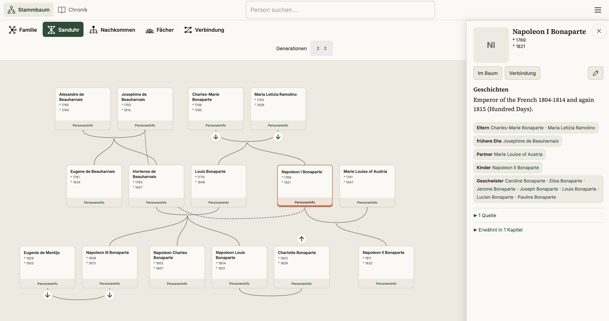

# stammgit

**AI-ready, Git-native family trees.** Your family data lives in your own
repository: YAML for people, Markdown for the chronicle, plain files for
documents and photos. Git keeps the history; the archive outlives the app.

That makes the repository something an AI assistant can work with directly:
tell it a story, let it add people, sources and chapters, run the validator,
and review the diff before you merge. Everything can equally be edited in the
browser, on your phone as well as on a desktop.

## Demo

**[stammgit-demo.netlify.app](https://stammgit-demo.netlify.app)** —
password `admin` (editing) or `user` (read-only).
Edits stay in your browser; the repository is unchanged.

[](https://stammgit-demo.netlify.app)

## Features

- Family, descendants and combined ancestors & descendants views.
- Semicircular ancestor fan with 1–10 generations, visible gaps and person information.
- Fitted first family view, remembered zoom and stable graph position while reading
  person information.
- Partner-aware layouts that keep couples together and avoid splitting unrelated
  sibling groups, without imposing a birth-date order.
- Connections between any number of people, including longer routes, partnerships
  and adoption; shared people appear once.
- Edit people in compact Person, Family, Sources and Photo tabs, including merge and delete.
  Changes stay on your device until **Sync**.
- Compact person panels, relationship descriptions and source evidence.
- Optional display names and recorded birth/death places, with full names and dates
  in person information and keyboard navigation in person search.
- Optional evidence ratings; an orange person-info badge highlights uncertainty.
- A searchable source catalogue with categories, individual evidence IDs, family
  filters, pagination and source details linked to the relevant people.
- Markdown chronicles with subtitles, document cards, optional translations and book printing.
- Optional device-local “Me” selection for relationship descriptions and starting points.
- Responsive desktop/mobile navigation, local fonts and accessible colour tokens.
- GEDCOM 5.5.1 and GEDCOM 7/GEDZIP import/export, including cited PDFs and portraits
  in GEDZIP; full YAML/JSON backups and source ZIP downloads.
- Admin and individually revocable reader access with server-side checks;
  English, German and Portuguese UI.

## Sources that remain usable

Keep original documents, family accounts and research articles as independent
sources. For a web page or individual finding, create a short evidence PDF with
a stable ID, citation, relevant facts and exact references. Update that item as
research improves. The catalogue groups documents into seven categories; family
tags filter evidence without becoming part of the PDFs or exchange exports.
Page citations and language versions refer to one canonical document.

See [Sources](docs/sources.md) for the structure, export boundaries and local
editorial tools. The public demo retains its existing sample documents; it does
not contain a private family archive.

## Get started

Use a **private repository** for real family data — see the
[setup guide](docs/setup.md) for your own copy, local hosting and Netlify.

Try it locally with Node 24 LTS:

```bash
git clone https://github.com/kstucki/stammgit.git
cd stammgit
npm install
cp .env.example .env    # set FAMILY_TREE_PASSWORD
npm start               # http://localhost:8888
```

### With an AI assistant

Point the assistant at your private copy. [AGENTS.md](AGENTS.md) holds the
rules it needs: preserve IDs and reciprocal links, attach sources, never
invent facts, and run `npm run build` — it validates every person, source,
photo and chapter reference and fails on anything broken. What survives the
build becomes a commit you can read like any other diff.

## What it is not

Svelte + TypeScript, built with Vite. No database, individual accounts, WYSIWYG
or social features. Single admin; Git is the collaboration model. Details and the
graph rules in [architecture](docs/architecture.md). If you need a full
genealogy suite, [Gramps](https://gramps-project.org) is excellent.

## Documentation

- [Setup](docs/setup.md) — private copy, local server and Netlify
- [Configuration](docs/configuration.md) — datasets, default view and starting points
- [Data format](docs/data-format.md) — people, relationships, sources and GEDCOM
- [Sources](docs/sources.md) — categories, evidence PDFs, metadata and exports
- [Chronicle](docs/chronicle.md) — writing and linking chapters
- [Architecture](docs/architecture.md) — non-goals, design decisions and graph rules
- [Development](docs/development.md) — tests, layout metrics and editing workflow
- [Changelog](docs/CHANGELOG.md)
- [Agent instructions](AGENTS.md)

## License

[MIT](LICENSE).
